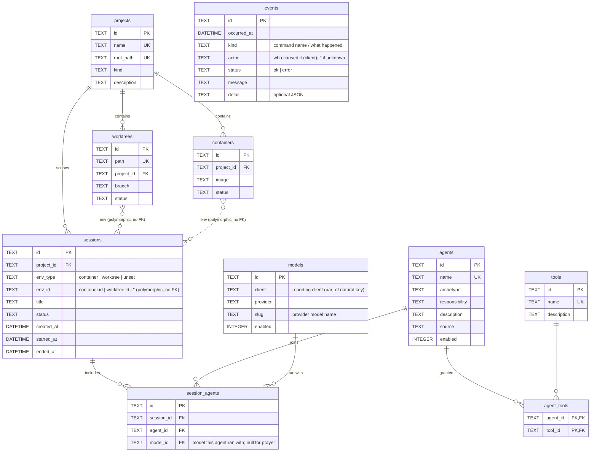

# Harness data model

- Status: Implemented
- Owner: hieu
- Reviewers: -
- Related ADRs: [ADR-0001](../adr/0001-harness-layout.md), [ADR-0002](../adr/0002-persistence-and-migrations.md), [ADR-0003](../adr/0003-authorization-casbin-abac.md), [ADR-0004](../adr/0004-ports-and-adapters-topology.md), [ADR-0005](../adr/0005-surrogate-uuid-v7-keys.md), [ADR-0006](../adr/0006-model-catalog-and-agent-profiles.md) (superseded), [ADR-0007](../adr/0007-roles-and-per-session-model-binding.md)

## Problem

Module 1 (`services/harness`) needs a persisted model for two things: the **declarative
agent team** (who can work) and the **runtime orchestration state** (work actually
happening). This spec is the reference for those domains, their schema, and the shared
packages that persist them.

## Goals / non-goals

- **Goals**: document the aggregates, their relationships, the SQLite schema, and the
  authorization model — as built.
- **Non-goals**: the application use cases, the client/MCP/events adapters, and the seed
  migration (see Open questions). Model *choices* live in
  [PDR-0001](../pdr/0001-default-team-model-assignments.md), not here.

## Design

### Two domains (one encapsulated `domain` package + per-aggregate Reader/Writer; UnitOfWork/ReadStore — [ADR-0013](../adr/0013-idiomatic-go-layout-and-unit-of-work.md), [ADR-0014](../adr/0014-domain-encapsulation-single-package.md))

The aggregates below live in a single `internal/domain` package with **unexported** fields;
the attribute lists are the conceptual data model (columns), reached via `NewXxx`/`RehydrateXxx`
and grouped views, not public Go fields ([ADR-0014](../adr/0014-domain-encapsulation-single-package.md)).

**agent** — the declarative team, as **roles** bound to models at session time
([ADR-0007](../adr/0007-roles-and-per-session-model-binding.md)):

- `Agent` aggregate (ID, Name, Archetype, Responsibility, Description, Source, Enabled,
  ToolIDs) — a pure **role**; it carries **no model** and no fallbacks. An agent's **persona**
  (its harness-owned system prompt) is **not** stored here — it is harness-owned *code*, a
  `domain.Persona` resolved by name via `domain.PersonaFor` and rendered to a prompt, distinct from
  the model (per session) and permissions (Casbin)
  ([ADR-0016](../adr/0016-harness-owned-agent-persona-governed-turn.md)). Council's persona is a
  typed **orchestration model** (`domain.CouncilProfile`) that renders to its prompt and defines the
  machine-readable `OrchestrationPlan` it emits ([ADR-0017](../adr/0017-council-orchestration-model.md));
  still not persisted.
  `ToolIDs` are grants into the tool catalog (persisted via `agent_tools`). Typed-string enums
  `Archetype` (communicator | principle-driven | utility-runner | none) and `Source`
  (system | user). `domain.AgentReader` exists (read by name via `query.ReadStore` →
  `infra/sqlite/readstore`, serving the `ResolveAgent` query's exists/enabled check); `Writer`
  added when a use case needs it.
- `Tool` aggregate (ID, Name, Description) — the capability **catalog**
  (read | grep | glob | list | edit | bash | webfetch | websearch), `domain.Tool`.
  (`domain.ToolReader`/`Writer` added when a use case needs it.)
- `Model` aggregate (ID, Client, Provider, Slug, Enabled) — the first-class catalog of available
  provider/model-ids (`Slug` is the provider's model name); `Client` is the reporting client and
  part of the natural key, since model names are client-specific
  ([ADR-0015](../adr/0015-client-aware-model-catalog.md)). `domain.Model`. Persisted via
  `domain.ModelWriter` through `command.UnitOfWork` →
  `infra/sqlite/{unitofwork,repo}`. Which model an agent uses is bound **per session** (see `Member.ModelID`),
  not stored on the agent.

Permissions are **not** here — authorization is Casbin
([ADR-0003](../adr/0003-authorization-casbin-abac.md)); the `infra/casbin` authorizer returns
`domain.Decision` (allow | ask | deny) for a `domain.Action`; the principal stays the agent
**name**.

**orchestration** — the runtime. A session is scoped to a project and runs in a polymorphic
environment (a container or a worktree, or none yet). See the [ERD](#schema-sqlite) below for
the full relationship picture.

Every aggregate has a **UUID v7 surrogate PK**; the natural keys below are `UNIQUE`
attributes, and references travel by UUID id ([ADR-0005](../adr/0005-surrogate-uuid-v7-keys.md)).

- `Project` (ID, Name UNIQUE, RootPath UNIQUE, Kind {single | monorepo}, Description) — repo `Projects`.
- `Worktree` (ID, Path UNIQUE, ProjectID, Branch, Status {active | stale}) — repo `Worktrees`.
- `Container` (ID, ProjectID, Image, Status) — an execution environment, sibling to worktree;
  repo `Containers`.
- `Session` (ID, ProjectID, EnvType {container | worktree | unset}, EnvID, Title,
  Status {pending | running | completed | failed | cancelled}, timestamps, Members) — repo
  `Sessions`. `EnvID` is a **polymorphic** reference (the container/worktree id, or empty when
  unset); it has no FK and is validated in the domain.
- `Member` (ID, AgentID, ModelID) — the agent↔session join (`session_agents`); `ModelID` is
  the model that agent ran with (empty for model-less `prayer`).
- `Event` (ID, OccurredAt, Kind, Actor, Status, Message, Detail) — one row of the **append-only
  audit log** (`events` table), written through a command audit decorator: what happened, who
  caused it, and how it ended. Standalone (no FK); distinct from the ephemeral stderr logs and
  from scribe's distilled lessons. Persisted via `domain.EventWriter`
  ([ADR-0018](../adr/0018-harness-observability-logging-audit-session.md)).

### Schema (SQLite)

`models`, `agents`, `tools`, `agent_tools`, `projects`, `containers`, `worktrees`,
`sessions`, `session_agents` — all created by one goose migration in FK order. Each aggregate
table has an `id TEXT PRIMARY KEY NOT NULL` (UUID v7) with the natural key as `UNIQUE NOT NULL`;
foreign keys reference the parent **id** (`agent_id`, `tool_id`, `model_id`, `project_id`,
`session_id`) with `ON DELETE CASCADE`. `agent_tools` is a **pure junction** (composite PK
`(agent_id, tool_id)`); `session_agents` carries `model_id` so it takes a surrogate `id` PK
with `UNIQUE(session_id, agent_id)`. `sessions.env_id` is a **polymorphic** reference keyed by
`sessions.env_type` and therefore has **no FK** (validated in the domain). `casbin_rule` is
created and owned by the Casbin gorm-adapter, **not** the migration.
Schema/repository/migration rules: [conventions/persistence.md](../conventions/persistence.md).

### Shared packages (`packages/go`)

`gormdb` (dialect-agnostic GORM bootstrap), `gormdb/sqlite` (the pure-Go SQLite
dialector), `migrate` (instance-based goose `Provider` wrapper + `Create`), `casbinx`
(enforcer over the shared `*gorm.DB`).

## Rollout / migration

The schema ships as embedded goose migrations applied via `services/harness/cmd/migrate`
(`up`/`down`/`status`/`version`/`create`) against `.cirius-harness/state/harness.sqlite`.
There is no production history yet, so the initial schema is a single `…_initialize.sql`.

## Open questions

- GORM **driven adapters** in `internal/infra` implementing the domain `Writer`/`Reader`
  interfaces via a `UnitOfWork`/`ReadStore` ([ADR-0013](../adr/0013-idiomatic-go-layout-and-unit-of-work.md))
  — the write side exposes `domain.ModelWriter`, `EventWriter`, `ProjectWriter`, and
  `SessionWriter` on `command.UnitOfWork` (`infra/sqlite/unitofwork` + `infra/sqlite/repo`): the
  harness records the audit log, the project, the session, and each agent run
  ([ADR-0018](../adr/0018-harness-observability-logging-audit-session.md)). The read side has its
  first reader (`infra/sqlite/readstore` + `infra/sqlite/repo`: `query.ReadStore` +
  `domain.AgentReader`, serving `ResolveAgent`'s exists/enabled check — the persona itself is a
  `domain.Persona` constant, not read from a column
  ([ADR-0016](../adr/0016-harness-owned-agent-persona-governed-turn.md))); the remaining read sides
  (model catalog, session/project queries) are deferred.
- The **`models` catalog is client-reported**, not seeded: a client syncs its enabled models
  in at session start and the catalog is a cumulative union, keyed **per client**
  `(client, provider, slug)` since model names are client-specific
  ([ADR-0011](../adr/0011-client-reported-model-catalog.md),
  [ADR-0015](../adr/0015-client-aware-model-catalog.md)). The original model seed was
  removed by `…_remove_model_seed.sql`.
- The **seed migration** still normalizes `.cirius-harness/00-system.yaml` into the `tools`
  catalog, the `agents` (roles), and their `agent_tools` grants. The per-agent **model** lines
  are not seeded — model is bound per session (`session_agents.model_id`). **Fallbacks** are
  not modeled yet. Agent **policies** into `casbin_rule` remain deferred (Casbin-owned,
  [ADR-0003](../adr/0003-authorization-casbin-abac.md)).
- **Unit of work** for cross-repository transactions (lands with the use cases).
- **Path-scoped permissions** for `scribe` (knowledge store only) via Casbin `keyMatch`.
- `cmd/harness` entrypoint exists with a `serve` subcommand — the Pi client stdio handshake
  ([ADR-0008](../adr/0008-pi-client-integration-stdio.md)). The `migrate` CLI may still fold
  into a subcommand later; MCP / events adapters and client **governance** remain deferred.

## References

- ADR-0001 / 0002 / 0003 above; [conventions/persistence.md](../conventions/persistence.md);
  [glossary](../glossary/README.md); `.cirius-harness/README.md`.
